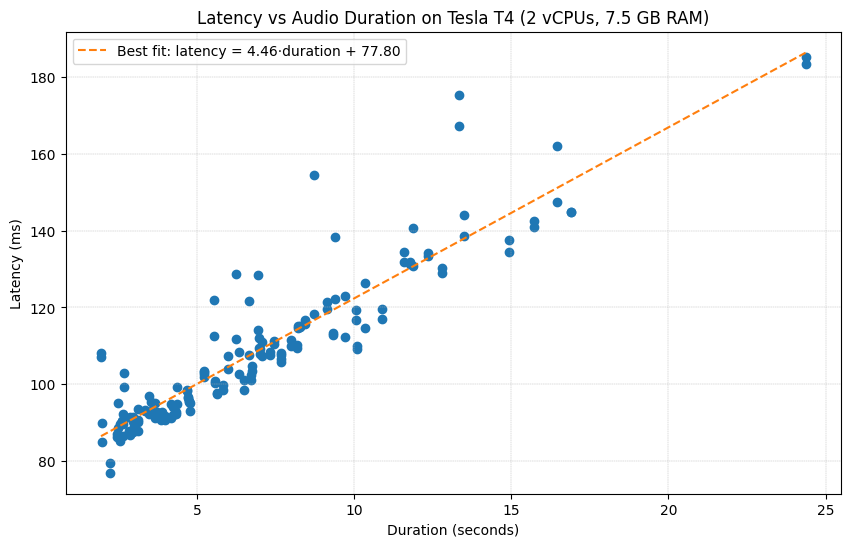

# Mimi Codec Service

A lightweight HTTP service that exposes the **Kyutai Mimi audio codec** as an API, converting short audio samples into discrete audio tokens.

The service is designed for **inference-only usage**, supports both **CPU and GPU execution**, and is containerized for easy deployment.

---

## Overview

This service provides a single HTTP endpoint that:

* accepts an audio file (various formats supported)
* decodes and resamples it
* runs the Mimi audio codec
* returns the resulting audio token codes and basic metadata

The implementation focuses on:

* simplicity
* reproducibility
* clear resource constraints
* minimal operational assumptions

---

## Model

* **Model**: [`kyutai/mimi`](https://huggingface.co/kyutai/mimi)
* **Type**: neural audio codec
* **Output**: discrete audio codes (multiple codebooks over time)

---

## API

### Health check

```http
GET /health
```

Response:

```json
{
  "status": "ok",
  "service": "mimi-audio-tokenizer",
  "device": "cuda:0",
  "device_mode": "CUDA"
}
```

---

### Process audio

```http
POST /process-audio
```

#### Request

* Multipart form upload
* Field name: `audio`

Example:

```bash
curl -X POST \
  -F "audio=@sample.flac" \
  http://localhost:8080/process-audio
```

#### Response (example)

```json
{
  "audio_codes": [[...]],
  "sample_rate": 24000,
  "duration_seconds": 2.13,
  "num_codebooks": 8,
  "axes": ["codebook", "time"],
  "latency_ms": 118.24,
  "device": "cuda:0",
  "model_id": "kyutai/mimi"
}
```

* `audio_codes` is indexed as **[codebook, time]**
* Latency is measured server-side for the full request

---

## Audio constraints

To prevent resource exhaustion, the service enforces:

* **Maximum duration**: 60 seconds
* **Maximum upload size**: 20 MB
* **Sample rate**: resampled internally to 24 kHz (mono)

### Supported formats

Any format decodable by **librosa / ffmpeg**, including (non-exhaustive):

* `.wav`
* `.flac`
* `.mp3`
* `.ogg`
* `.m4a`

---

## Running with Docker

### GPU (recommended)

A GPU-enabled image is provided and intended as the primary deployment target.

This configuration was tested on:

* **GPU**: NVIDIA Tesla T4
* **Instance**: n1-standard-2 (2 vCPUs, 7.5 GB RAM)
* **CUDA**: 12.x

#### Run

```bash
docker run \
  --gpus all \
  -p 8080:8080 \
  -e DEVICE=CUDA \
  rafeller/mimi-api:gpu
```

---

### CPU

A CPU-only image is also available.

```bash
docker run \
  -p 8080:8080 \
  -e DEVICE=CPU \
  rafeller/mimi-api:cpu
```

---

## Device selection

The execution device is controlled via the `DEVICE` environment variable:

* `CUDA` — force GPU execution (fails if unavailable)
* `CPU` — force CPU execution
* `AUTO` — use GPU if available, otherwise CPU (default)

---

## Dependency management

This project is built with **[uv](https://docs.astral.sh/uv/)** as the primary dependency manager.

* Dependencies are defined in `pyproject.toml`
* A `uv.lock` file ensures reproducible installs
* A `requirements.txt` export is also provided for compatibility with non-uv workflows

---

## Benchmarking

A small benchmarking script is included to measure latency across samples:

* supports warmup runs
* records per-sample latency and duration
* outputs results as CSV for easy comparison

Example usage:

```bash
python benchmark_mimi_api.py \
  --samples-dir ./samples \
  --run-name gpu_t4 \
  --n-warmup 3 \
  --output results.csv
```

The obtained benchmark results for the T4 instance are shown below:



We can see the generally linear relationship between latency and audio duration for this non-batched implementation.

---

## Notes

* The service is inference-only
* Requests are processed independently (no batching)
* No authentication or rate limiting is implemented
* Designed for clarity and evaluation rather than production hardening

---

## Acknowledgements

* Kyutai for the Mimi codec
* Hugging Face Transformers for model integration
